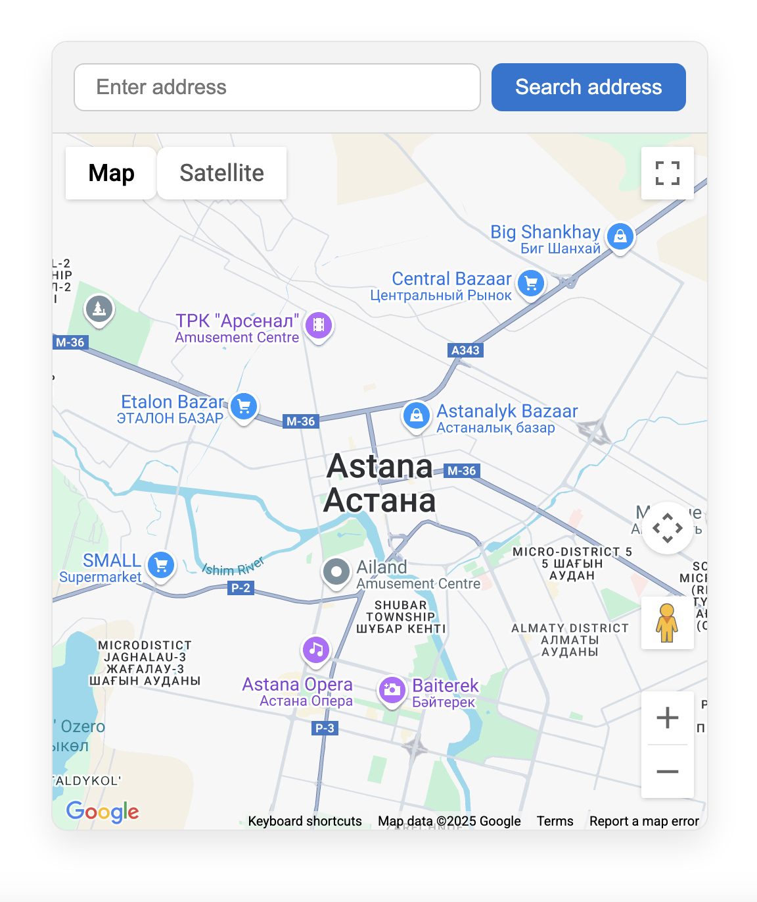
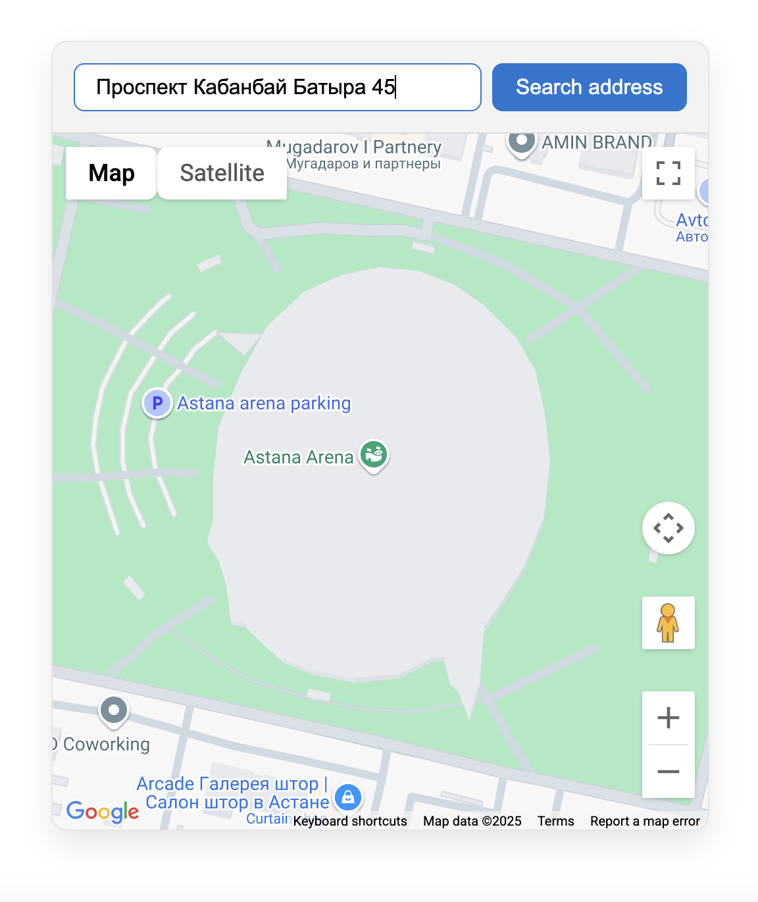

# Google Maps API Integration App

This project is a simple React + TypeScript application that integrates Google Maps using the `@vis.gl/react-google-maps` library. It allows users to search for an address and interact with the map by clicking to set markers. The application dynamically adjusts the map zoom level based on the type of location returned from the Google Geocoding API.

## Features

- Google Maps integration with custom API key
- Address search functionality
- Dynamic zoom based on location type (e.g., street, city, country)
- Click on the map to set a marker and capture coordinates (lat, lng)
- Auto-location detection using browser geolocation

## Tech Stack

- **React**
- **TypeScript**
- **CSS**
- **HTML**
- **Axios**
- **@vis.gl/react-google-maps**

## Running a Project

1. Get your [Google Maps API key](https://console.cloud.google.com/).
2. Create a `.env` file in the root directory and write your api key.

## Screenshots

  
  

